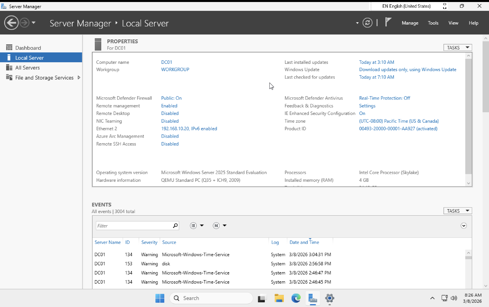
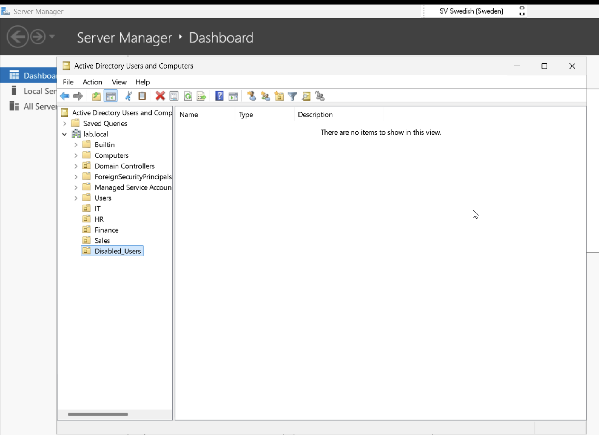
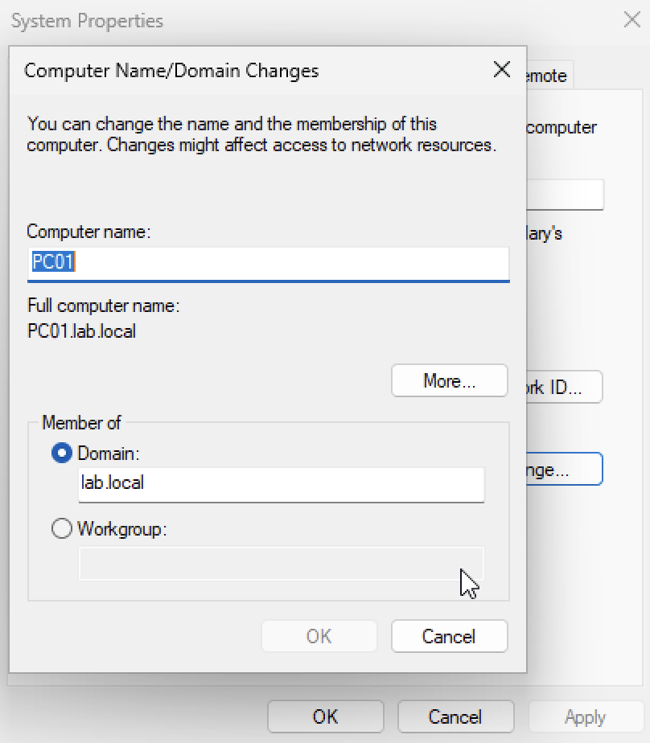
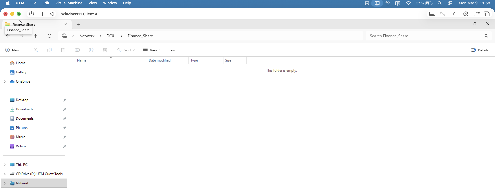

# Active Directory Home Lab – Windows Server 2025

## Project Overview

This project demonstrates the deployment and administration of an Active Directory environment using Windows Server 2025 and a Windows 11 client workstation.

The lab simulates real enterprise IT support tasks including:

- Domain Controller deployment
- DNS configuration
- Organizational Unit design
- Security group management
- User lifecycle management
- Domain authentication
- Role-based file share access control

This environment replicates a small company network using pfSense, Windows Server, and Windows 11.

---

## Lab Architecture

Network design:

pfSense Firewall – 192.168.10.1  
Windows 11 Client – 192.168.10.10  
Domain Controller (DC01) – 192.168.10.20  
Ubuntu Server – 192.168.10.30  
Ubuntu Desktop – 192.168.10.40  

Domain Name:

lab.local

---

## Technologies Used

- Windows Server 2025
- Active Directory Domain Services
- DNS
- Windows 11
- pfSense Firewall
- UTM Virtualization
- Organizational Units
- Security Groups
- NTFS Permissions
- File Sharing

---

## Key Skills Demonstrated

- Active Directory deployment
- DNS configuration
- Organizational Unit design
- Security group management
- User lifecycle management
- Domain authentication
- File share permission management
- Role-based access control

---

## Documentation

Full project documentation is available in this repository:

Active-Directory-Home-Lab.pdf

---

## Screenshots

Example steps from the lab:

### Domain Controller Setup

### Organizational Unit Structure

### Domain Join

### Domain User Login

### File Share Access Test

---

## Author

Kelvin Jacob Marcar  
IT Support / Cybersecurity Enthusiast

